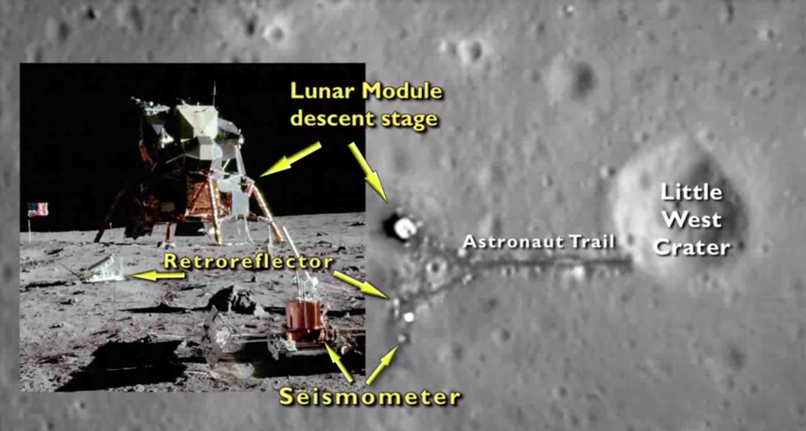
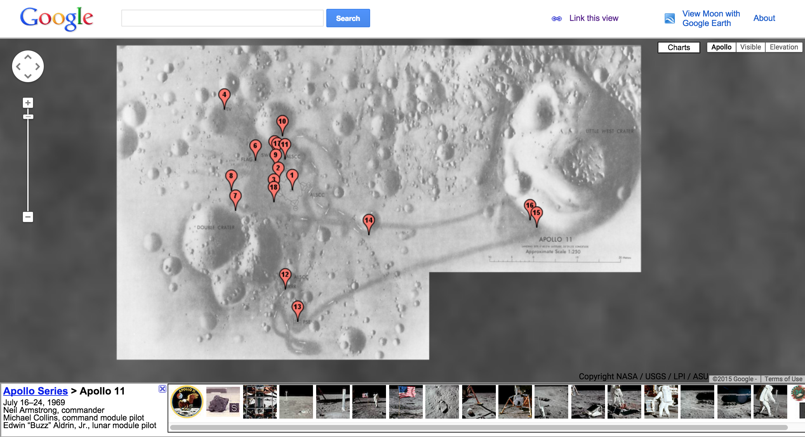

### General research media
- Apollo Image archive: http://apollo.sese.asu.edu/    
- Images from NASA: https://www.nasa.gov/apollo11-gallery
- Audio from NASA: https://www.nasa.gov/content/apollo-11-audio-highlights
- Video from NASA: https://www.nasa.gov/multimedia/hd/apollo11_hdpage.html

### NASA's 3D imaging of landing site using LRO data:

[Link to video](http://commons.wikimedia.org/w/index.php?title=File%3AA_New_Look_at_the_Apollo_11_Landing_Site.ogg)

### [NASA's LRO Data Volumes](http://img.pds.nasa.gov/volumes/lro.html)

### [NASA's LRO Tutorials](http://img.pds.nasa.gov/software/) 
(yet to determine if these tutorials are useful to this project, look for Lunar Reconnaissance Orbiter section)

### Google moon 

[Link to Apollo 11 section of Google moon](http://www.google.com/moon/#lat=0.655754&lon=23.471664&zoom=18&apollo=a11)

### Apollo 11 aerial landing site images

[Apollo 11 revisted LROC](http://www.nasa.gov/mission_pages/LRO/news/apollo-11.html)

[A second look at Apollo 11](https://www.nasa.gov/mission_pages/LRO/multimedia/lroimages/lroc_20090929_apollo11.html#.VT5cf61Viko)

[LRO gets additional look at Apollo 11 landing site](https://www.nasa.gov/mission_pages/LRO/multimedia/lroimages/lroc_200911109_apollo11.html#.VT5cdK1Viko)

### Surface images

#### [Interactive 360 panorama](http://www.panoramas.dk/moon/apollo-11.html)

#### Near seismometer

#### Near Little West

#### Lunar lander panorama

#### Lunar Landing Demo

[Done by Nvidia, uses UE4](http://www.nvidia.com/coolstuff/demos#!/apollo-11)
